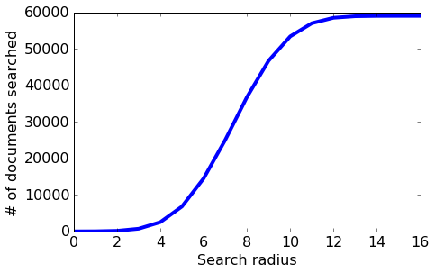
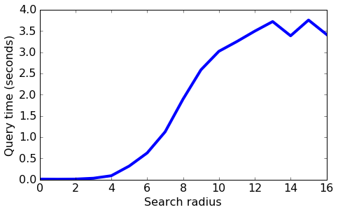
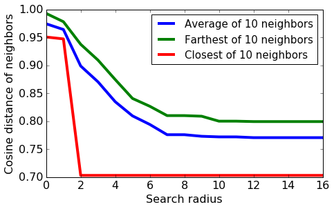
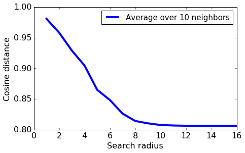
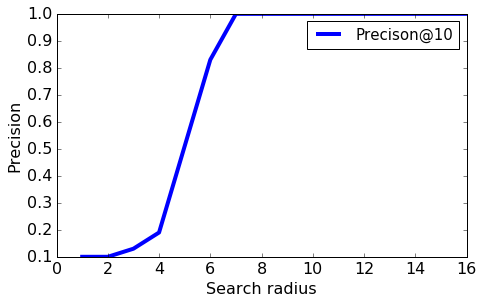
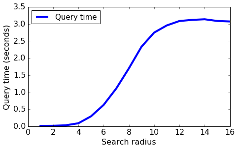
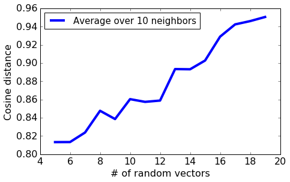
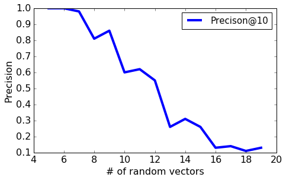
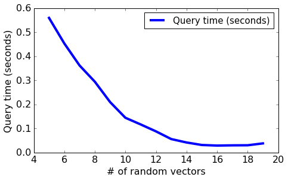
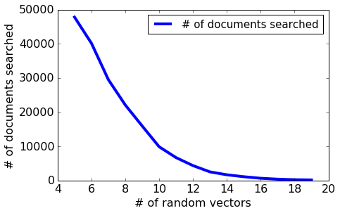

# Locality Sensitive Hashing

Locality Sensitive Hashing (LSH) provides for a fast, efficient approximate nearest neighbor search. The algorithm scales well with respect to the number of data points as well as dimensions.

In this assignment, you will
* Implement the LSH algorithm for approximate nearest neighbor search
* Examine the accuracy for different documents by comparing against brute force search, and also contrast runtimes
* Explore the role of the algorithm’s tuning parameters in the accuracy of the method

**Note to Amazon EC2 users**: To conserve memory, make sure to stop all the other notebooks before running this notebook.

## Import necessary packages

The following code block will check if you have the correct version of GraphLab Create. Any version later than 1.8.5 will do. To upgrade, read [this page](https://turi.com/download/upgrade-graphlab-create.html).


```python
import numpy as np                                             # dense matrices
import pandas as pd                                            # see below for install instruction
import json
from scipy.sparse import csr_matrix                            # sparse matrices
from sklearn.metrics.pairwise import pairwise_distances        # pairwise distances
from copy import copy                                          # deep copies
import matplotlib.pyplot as plt                                # plotting
%matplotlib inline

'''compute norm of a sparse vector
   Thanks to: Jaiyam Sharma'''
def norm(x):
    sum_sq=x.dot(x.T)
    norm=np.sqrt(sum_sq)
    return(norm)
```

## Load in the Wikipedia dataset


```python
wiki = pd.read_csv('people_wiki.csv')
```


```python
wiki.head(2)
```


<div>
<table border="1" class="dataframe">
  <thead>
    <tr style="text-align: right;">
      <th></th>
      <th>URI</th>
      <th>name</th>
      <th>text</th>
    </tr>
  </thead>
  <tbody>
    <tr>
      <th>0</th>
      <td>&lt;http://dbpedia.org/resource/Digby_Morrell&gt;</td>
      <td>Digby Morrell</td>
      <td>digby morrell born 10 october 1979 is a former...</td>
    </tr>
    <tr>
      <th>1</th>
      <td>&lt;http://dbpedia.org/resource/Alfred_J._Lewy&gt;</td>
      <td>Alfred J. Lewy</td>
      <td>alfred j lewy aka sandy lewy graduated from un...</td>
    </tr>
  </tbody>
</table>
</div>


```python
wiki.shape
```


    (59071, 3)


For this assignment, let us assign a unique ID to each document.

## Extract TF-IDF matrix

We first use GraphLab Create to compute a TF-IDF representation for each document.


```python
def load_sparse_csr(filename):
    loader = np.load(filename)
    data = loader['data']
    indices = loader['indices']
    indptr = loader['indptr']
    shape = loader['shape']
    
    return csr_matrix( (data, indices, indptr), shape)
    
corpus = load_sparse_csr('people_wiki_tf_idf.npz')
```


```python
with open('people_wiki_map_index_to_word.json') as people_wiki_map_index_to_word:    
    map_index_to_word = json.load(people_wiki_map_index_to_word)
```


```python
print len(map_index_to_word)
print corpus.shape
```

    547979
    (59071, 547979)
    

For the remainder of the assignment, we will use sparse matrices. Sparse matrices are [matrices](https://en.wikipedia.org/wiki/Matrix_(mathematics%29 ) that have a small number of nonzero entries. A good data structure for sparse matrices would only store the nonzero entries to save space and speed up computation. SciPy provides a highly-optimized library for sparse matrices. Many matrix operations available for NumPy arrays are also available for SciPy sparse matrices.

We first convert the TF-IDF column (in dictionary format) into the SciPy sparse matrix format.


```python

```

The conversion should take a few minutes to complete.

**Checkpoint**: The following code block should return 'Check passed correctly', indicating that your matrix contains TF-IDF values for 59071 documents and 547979 unique words.  Otherwise, it will return Error.


```python
assert corpus.shape == (59071, 547979)
print 'Check passed correctly!'
```

    Check passed correctly!
    

## Train an LSH model

LSH performs an efficient neighbor search by randomly partitioning all reference data points into different bins. Today we will build a popular variant of LSH known as random binary projection, which approximates cosine distance. There are other variants we could use for other choices of distance metrics.

The first step is to generate a collection of random vectors from the standard Gaussian distribution.


```python
def generate_random_vectors(num_vector, dim):
    return np.random.randn(dim, num_vector)
```

To visualize these Gaussian random vectors, let's look at an example in low-dimensions.  Below, we generate 3 random vectors each of dimension 5.


```python
# Generate 3 random vectors of dimension 5, arranged into a single 5 x 3 matrix.
np.random.seed(0) # set seed=0 for consistent results
print generate_random_vectors(num_vector=3, dim=5)
```

    [[ 1.76405235  0.40015721  0.97873798]
     [ 2.2408932   1.86755799 -0.97727788]
     [ 0.95008842 -0.15135721 -0.10321885]
     [ 0.4105985   0.14404357  1.45427351]
     [ 0.76103773  0.12167502  0.44386323]]
    

We now generate random vectors of the same dimensionality as our vocubulary size (547979).  Each vector can be used to compute one bit in the bin encoding.  We generate 16 vectors, leading to a 16-bit encoding of the bin index for each document.


```python
# Generate 16 random vectors of dimension 547979
np.random.seed(0)
random_vectors = generate_random_vectors(num_vector=16, dim=547979)
print random_vectors.shape
```

    (547979L, 16L)
    

Next, we partition data points into bins. Instead of using explicit loops, we'd like to utilize matrix operations for greater efficiency. Let's walk through the construction step by step.

We'd like to decide which bin document 0 should go. Since 16 random vectors were generated in the previous cell, we have 16 bits to represent the bin index. The first bit is given by the sign of the dot product between the first random vector and the document's TF-IDF vector.


```python
doc = corpus[0, :] # vector of tf-idf values for document 0
print doc.dot(random_vectors[:, 0]) >= 0 # True if positive sign; False if negative sign
```

    [ True]
    

Similarly, the second bit is computed as the sign of the dot product between the second random vector and the document vector.


```python
print doc.dot(random_vectors[:, 1]) >= 0 # True if positive sign; False if negative sign
```

    [ True]
    

We can compute all of the bin index bits at once as follows. Note the absence of the explicit `for` loop over the 16 vectors. Matrix operations let us batch dot-product computation in a highly efficent manner, unlike the `for` loop construction. Given the relative inefficiency of loops in Python, the advantage of matrix operations is even greater.


```python
print doc.dot(random_vectors) >= 0 # should return an array of 16 True/False bits
print np.array(doc.dot(random_vectors) >= 0, dtype=int) # display index bits in 0/1's
```

    [[ True  True False False False  True  True False  True  True  True False
      False  True False  True]]
    [[1 1 0 0 0 1 1 0 1 1 1 0 0 1 0 1]]
    

All documents that obtain exactly this vector will be assigned to the same bin. We'd like to repeat the identical operation on all documents in the Wikipedia dataset and compute the corresponding bin indices. Again, we use matrix operations  so that no explicit loop is needed.


```python
print corpus[0:2].dot(random_vectors) >= 0 # compute bit indices of first two documents
print corpus.dot(random_vectors) >= 0 # compute bit indices of ALL documents
```

    [[ True  True False False False  True  True False  True  True  True False
      False  True False  True]
     [ True False False False  True  True False  True  True False  True False
       True False False  True]]
    [[ True  True False ...,  True False  True]
     [ True False False ..., False False  True]
     [False  True False ...,  True False  True]
     ..., 
     [ True  True False ...,  True  True  True]
     [False  True  True ...,  True False  True]
     [ True False  True ..., False False  True]]
    

We're almost done! To make it convenient to refer to individual bins, we convert each binary bin index into a single integer: 
```
Bin index                      integer
[0,0,0,0,0,0,0,0,0,0,0,0]   => 0
[0,0,0,0,0,0,0,0,0,0,0,1]   => 1
[0,0,0,0,0,0,0,0,0,0,1,0]   => 2
[0,0,0,0,0,0,0,0,0,0,1,1]   => 3
...
[1,1,1,1,1,1,1,1,1,1,0,0]   => 65532
[1,1,1,1,1,1,1,1,1,1,0,1]   => 65533
[1,1,1,1,1,1,1,1,1,1,1,0]   => 65534
[1,1,1,1,1,1,1,1,1,1,1,1]   => 65535 (= 2^16-1)
```
By the [rules of binary number representation](https://en.wikipedia.org/wiki/Binary_number#Decimal), we just need to compute the dot product between the document vector and the vector consisting of powers of 2:


```python
doc = corpus[0, :]  # first document
index_bits = (doc.dot(random_vectors) >= 0)
powers_of_two = (1 << np.arange(15, -1, -1))
print index_bits
print powers_of_two           # [32768, 16384, 8192, 4096, 2048, 1024, 512, 256, 128, 64, 32, 16, 8, 4, 2, 1]
print index_bits.dot(powers_of_two)
```

    [[ True  True False False False  True  True False  True  True  True False
      False  True False  True]]
    [32768 16384  8192  4096  2048  1024   512   256   128    64    32    16
         8     4     2     1]
    [50917]
    

Since it's the dot product again, we batch it with a matrix operation:


```python
index_bits = corpus.dot(random_vectors) >= 0
print index_bits.dot(powers_of_two)
print len(index_bits.dot(powers_of_two))
```

    [50917 36265 19365 ..., 52983 27589 41449]
    59071
    

This array gives us the integer index of the bins for all documents.

Now we are ready to complete the following function. Given the integer bin indices for the documents, you should compile a list of document IDs that belong to each bin. Since a list is to be maintained for each unique bin index, a dictionary of lists is used.

1. Compute the integer bin indices. This step is already completed.
2. For each document in the dataset, do the following:
   * Get the integer bin index for the document.
   * Fetch the list of document ids associated with the bin; if no list yet exists for this bin, assign the bin an empty list.
   * Add the document id to the end of the list.


```python
def train_lsh(data, num_vector=16, seed=None):
    
    dim = data.shape[1]
    if seed is not None:
        np.random.seed(seed)
    random_vectors = generate_random_vectors(num_vector, dim)
  
    powers_of_two = 1 << np.arange(num_vector-1, -1, -1)
  
    table = {}
    
    # Partition data points into bins
    bin_index_bits = (data.dot(random_vectors) >= 0)
  
    # Encode bin index bits into integers
    bin_indices = bin_index_bits.dot(powers_of_two)
    
    # Update `table` so that `table[i]` is the list of document ids with bin index equal to i.
    for data_index, bin_index in enumerate(bin_indices):
        if bin_index not in table:
            # If no list yet exists for this bin, assign the bin an empty list.
            table[bin_index] = [] # YOUR CODE HERE
        # Fetch the list of document ids associated with the bin and add the document id to the end.
        # YOUR CODE HERE
        table[bin_index].append(data_index)

    model = {'data': data,
             'bin_index_bits': bin_index_bits,
             'bin_indices': bin_indices,
             'table': table,
             'random_vectors': random_vectors,
             'num_vector': num_vector}
    
    return model
```

**Checkpoint**. 


```python
model = train_lsh(corpus, num_vector=16, seed=143)
table = model['table']
if   0 in table and table[0]   == [39583] and \
   143 in table and table[143] == [19693, 28277, 29776, 30399]:
    print 'Passed!'
else:
    print 'Check your code.'
```

    Passed!
    

**Note.** We will be using the model trained here in the following sections, unless otherwise indicated.

## Inspect bins

Let us look at some documents and see which bins they fall into.


```python
print wiki[wiki['name'] == 'Barack Obama']
```

                                                  URI          name  \
    35817  <http://dbpedia.org/resource/Barack_Obama>  Barack Obama   
    
                                                        text  
    35817  barack hussein obama ii brk husen bm born augu...  
    

**Quiz Question**. What is the document `id` of Barack Obama's article?

**Quiz Question**. Which bin contains Barack Obama's article? Enter its integer index.


```python
"""
index_bits_obama = corpus[35817,:].dot(random_vectors) >= 0
print index_bits_obama.dot(powers_of_two)
print index_bits_obama % 2
"""
```

    [29090]
    [[0 1 1 1 0 0 0 1 1 0 1 0 0 0 1 0]]
    


```python
print np.array(model['bin_index_bits'][22745], dtype=int) # list of 0/1's
```

    [0 0 0 1 0 0 1 0 0 0 1 1 0 1 0 0]
    

Recall from the previous assignment that Joe Biden was a close neighbor of Barack Obama.


```python
print wiki[wiki['name'] == 'Joe Biden']
```

                                               URI       name  \
    24478  <http://dbpedia.org/resource/Joe_Biden>  Joe Biden   
    
                                                        text  
    24478  joseph robinette joe biden jr dosf rbnt badn b...  
    


```python
"""
index_bits_biden = corpus[24478,:].dot(random_vectors) >= 0
print index_bits_biden.dot(powers_of_two)
print index_bits_biden % 2
"""
```

    [11619]
    [[0 0 1 0 1 1 0 1 0 1 1 0 0 0 1 1]]
    


```python
print np.array(model['bin_index_bits'][24478], dtype=int) # list of 0/1's
```

    [1 0 0 0 0 1 0 0 0 0 0 0 0 0 1 0]
    


```python
"""
print (index_bits_obama.flatten() % 2 + index_bits_biden.flatten() % 2) 
print (index_bits_obama.flatten() % 2 + index_bits_biden.flatten() % 2)  % 2
print len(index_bits_obama.flatten()) - sum((index_bits_obama.flatten() % 2 + index_bits_biden.flatten() % 2)  % 2)
"""
```

    [0 1 2 1 1 1 0 2 1 1 2 0 0 0 2 1]
    [0 1 0 1 1 1 0 0 1 1 0 0 0 0 0 1]
    9
    


```python
print (np.array(model['bin_index_bits'][35817] == model['bin_index_bits'][24478], dtype=int))
print np.sum(np.array(model['bin_index_bits'][35817] == model['bin_index_bits'][24478], dtype=int))
```

    [1 0 1 1 1 1 1 1 1 1 1 0 1 1 1 1]
    14
    

**Quiz Question**. Examine the bit representations of the bins containing Barack Obama and Joe Biden. In how many places do they agree?

1. 16 out of 16 places (Barack Obama and Joe Biden fall into the same bin)
2. 14 out of 16 places
3. 12 out of 16 places
4. 10 out of 16 places
5. 8 out of 16 places


```python

```


```python

```

Compare the result with a former British diplomat, whose bin representation agrees with Obama's in only 8 out of 16 places.


```python
wiki[wiki['name']=='Wynn Normington Hugh-Jones']
```


```python
print wiki[wiki['name']=='Wynn Normington Hugh-Jones']

print np.array(model['bin_index_bits'][22745], dtype=int) # list of 0/1's
print np.sum(np.array(model['bin_index_bits'][35817] == model['bin_index_bits'][22745]))
```

                                                         URI  \
    22745  <http://dbpedia.org/resource/Wynn_Normington_H...   
    
                                 name  \
    22745  Wynn Normington Hugh-Jones   
    
                                                        text  
    22745  sir wynn normington hughjones kb sometimes kno...  
    [0 0 0 1 0 0 1 0 0 0 1 1 0 1 0 0]
    8
    

How about the documents in the same bin as Barack Obama? Are they necessarily more similar to Obama than Biden?  Let's look at which documents are in the same bin as the Barack Obama article.


```python
model['bin_indices'][35817]
```


    50194


```python
print model['table'][model['bin_indices'][35817]]
```

    [21426, 35817, 39426, 50261, 53937]
    

There are four other documents that belong to the same bin. Which documents are they?


```python
doc_ids = list(model['table'][model['bin_indices'][35817]])
doc_ids.remove(35817) # display documents other than Obama

wiki.loc[doc_ids] # filter by id column

#It turns out that Joe Biden is much closer to Barack Obama than any of the four documents, even though Biden's bin representation differs from Obama's by 2 bits.
```


<div>
<table border="1" class="dataframe">
  <thead>
    <tr style="text-align: right;">
      <th></th>
      <th>URI</th>
      <th>name</th>
      <th>text</th>
    </tr>
  </thead>
  <tbody>
    <tr>
      <th>21426</th>
      <td>&lt;http://dbpedia.org/resource/Mark_Boulware&gt;</td>
      <td>Mark Boulware</td>
      <td>mark boulware born 1948 is an american diploma...</td>
    </tr>
    <tr>
      <th>39426</th>
      <td>&lt;http://dbpedia.org/resource/John_Wells_(polit...</td>
      <td>John Wells (politician)</td>
      <td>sir john julius wells born 30 march 1925 is a ...</td>
    </tr>
    <tr>
      <th>50261</th>
      <td>&lt;http://dbpedia.org/resource/Francis_Longstaff&gt;</td>
      <td>Francis Longstaff</td>
      <td>francis a longstaff born august 3 1956 is an a...</td>
    </tr>
    <tr>
      <th>53937</th>
      <td>&lt;http://dbpedia.org/resource/Madurai_T._Sriniv...</td>
      <td>Madurai T. Srinivasan</td>
      <td>maduraitsrinivasan is a wellknown figure in th...</td>
    </tr>
  </tbody>
</table>
</div>


It turns out that Joe Biden is much closer to Barack Obama than any of the four documents, even though Biden's bin representation differs from Obama's by 2 bits.


```python
def cosine_distance(x, y):
    xy = x.dot(y.T)
    dist = xy/(norm(x)*norm(y))
    return 1-dist[0,0]

obama_tf_idf = corpus[35817,:]
biden_tf_idf = corpus[24478,:]

print '================= Cosine distance from Barack Obama'
print 'Barack Obama - {0:24s}: {1:f}'.format('Joe Biden',
                                             cosine_distance(obama_tf_idf, biden_tf_idf))
for doc_id in doc_ids:
    doc_tf_idf = corpus[doc_id,:]
    print 'Barack Obama - {0:24s}: {1:f}'.format(wiki.iloc[doc_id]['name'],
                                                 cosine_distance(obama_tf_idf, doc_tf_idf))
```

    ================= Cosine distance from Barack Obama
    Barack Obama - Joe Biden               : 0.703139
    Barack Obama - Mark Boulware           : 0.950867
    Barack Obama - John Wells (politician) : 0.975966
    Barack Obama - Francis Longstaff       : 0.978256
    Barack Obama - Madurai T. Srinivasan   : 0.993092
    

**Moral of the story**. Similar data points will in general _tend to_ fall into _nearby_ bins, but that's all we can say about LSH. In a high-dimensional space such as text features, we often get unlucky with our selection of only a few random vectors such that dissimilar data points go into the same bin while similar data points fall into different bins. **Given a query document, we must consider all documents in the nearby bins and sort them according to their actual distances from the query.**

## Query the LSH model

Let us first implement the logic for searching nearby neighbors, which goes like this:
```
1. Let L be the bit representation of the bin that contains the query documents.
2. Consider all documents in bin L.
3. Consider documents in the bins whose bit representation differs from L by 1 bit.
4. Consider documents in the bins whose bit representation differs from L by 2 bits.
...
```

To obtain candidate bins that differ from the query bin by some number of bits, we use `itertools.combinations`, which produces all possible subsets of a given list. See [this documentation](https://docs.python.org/3/library/itertools.html#itertools.combinations) for details.
```
1. Decide on the search radius r. This will determine the number of different bits between the two vectors.
2. For each subset (n_1, n_2, ..., n_r) of the list [0, 1, 2, ..., num_vector-1], do the following:
   * Flip the bits (n_1, n_2, ..., n_r) of the query bin to produce a new bit vector.
   * Fetch the list of documents belonging to the bin indexed by the new bit vector.
   * Add those documents to the candidate set.
```

Each line of output from the following cell is a 3-tuple indicating where the candidate bin would differ from the query bin. For instance,
```
(0, 1, 3)
```
indicates that the candiate bin differs from the query bin in first, second, and fourth bits.


```python
from itertools import combinations

num_vector = 16
search_radius = 3

for diff in combinations(range(num_vector), search_radius):
    print diff
```

    (0, 1, 2)
    (0, 1, 3)
    (0, 1, 4)
    (0, 1, 5)
    (0, 1, 6)
    (0, 1, 7)
    (0, 1, 8)
    (0, 1, 9)
    (0, 1, 10)
    (0, 1, 11)
    (0, 1, 12)
    (0, 1, 13)
    (0, 1, 14)
    (0, 1, 15)
    (0, 2, 3)
    (0, 2, 4)
    (0, 2, 5)
    (0, 2, 6)
    (0, 2, 7)
    (0, 2, 8)
    (0, 2, 9)
    (0, 2, 10)
    (0, 2, 11)
    (0, 2, 12)
    (0, 2, 13)
    (0, 2, 14)
    (0, 2, 15)
    (0, 3, 4)
    (0, 3, 5)
    (0, 3, 6)
    (0, 3, 7)
    (0, 3, 8)
    (0, 3, 9)
    (0, 3, 10)
    (0, 3, 11)
    (0, 3, 12)
    (0, 3, 13)
    (0, 3, 14)
    (0, 3, 15)
    (0, 4, 5)
    (0, 4, 6)
    (0, 4, 7)
    (0, 4, 8)
    (0, 4, 9)
    (0, 4, 10)
    (0, 4, 11)
    (0, 4, 12)
    (0, 4, 13)
    (0, 4, 14)
    (0, 4, 15)
    (0, 5, 6)
    (0, 5, 7)
    (0, 5, 8)
    (0, 5, 9)
    (0, 5, 10)
    (0, 5, 11)
    (0, 5, 12)
    (0, 5, 13)
    (0, 5, 14)
    (0, 5, 15)
    (0, 6, 7)
    (0, 6, 8)
    (0, 6, 9)
    (0, 6, 10)
    (0, 6, 11)
    (0, 6, 12)
    (0, 6, 13)
    (0, 6, 14)
    (0, 6, 15)
    (0, 7, 8)
    (0, 7, 9)
    (0, 7, 10)
    (0, 7, 11)
    (0, 7, 12)
    (0, 7, 13)
    (0, 7, 14)
    (0, 7, 15)
    (0, 8, 9)
    (0, 8, 10)
    (0, 8, 11)
    (0, 8, 12)
    (0, 8, 13)
    (0, 8, 14)
    (0, 8, 15)
    (0, 9, 10)
    (0, 9, 11)
    (0, 9, 12)
    (0, 9, 13)
    (0, 9, 14)
    (0, 9, 15)
    (0, 10, 11)
    (0, 10, 12)
    (0, 10, 13)
    (0, 10, 14)
    (0, 10, 15)
    (0, 11, 12)
    (0, 11, 13)
    (0, 11, 14)
    (0, 11, 15)
    (0, 12, 13)
    (0, 12, 14)
    (0, 12, 15)
    (0, 13, 14)
    (0, 13, 15)
    (0, 14, 15)
    (1, 2, 3)
    (1, 2, 4)
    (1, 2, 5)
    (1, 2, 6)
    (1, 2, 7)
    (1, 2, 8)
    (1, 2, 9)
    (1, 2, 10)
    (1, 2, 11)
    (1, 2, 12)
    (1, 2, 13)
    (1, 2, 14)
    (1, 2, 15)
    (1, 3, 4)
    (1, 3, 5)
    (1, 3, 6)
    (1, 3, 7)
    (1, 3, 8)
    (1, 3, 9)
    (1, 3, 10)
    (1, 3, 11)
    (1, 3, 12)
    (1, 3, 13)
    (1, 3, 14)
    (1, 3, 15)
    (1, 4, 5)
    (1, 4, 6)
    (1, 4, 7)
    (1, 4, 8)
    (1, 4, 9)
    (1, 4, 10)
    (1, 4, 11)
    (1, 4, 12)
    (1, 4, 13)
    (1, 4, 14)
    (1, 4, 15)
    (1, 5, 6)
    (1, 5, 7)
    (1, 5, 8)
    (1, 5, 9)
    (1, 5, 10)
    (1, 5, 11)
    (1, 5, 12)
    (1, 5, 13)
    (1, 5, 14)
    (1, 5, 15)
    (1, 6, 7)
    (1, 6, 8)
    (1, 6, 9)
    (1, 6, 10)
    (1, 6, 11)
    (1, 6, 12)
    (1, 6, 13)
    (1, 6, 14)
    (1, 6, 15)
    (1, 7, 8)
    (1, 7, 9)
    (1, 7, 10)
    (1, 7, 11)
    (1, 7, 12)
    (1, 7, 13)
    (1, 7, 14)
    (1, 7, 15)
    (1, 8, 9)
    (1, 8, 10)
    (1, 8, 11)
    (1, 8, 12)
    (1, 8, 13)
    (1, 8, 14)
    (1, 8, 15)
    (1, 9, 10)
    (1, 9, 11)
    (1, 9, 12)
    (1, 9, 13)
    (1, 9, 14)
    (1, 9, 15)
    (1, 10, 11)
    (1, 10, 12)
    (1, 10, 13)
    (1, 10, 14)
    (1, 10, 15)
    (1, 11, 12)
    (1, 11, 13)
    (1, 11, 14)
    (1, 11, 15)
    (1, 12, 13)
    (1, 12, 14)
    (1, 12, 15)
    (1, 13, 14)
    (1, 13, 15)
    (1, 14, 15)
    (2, 3, 4)
    (2, 3, 5)
    (2, 3, 6)
    (2, 3, 7)
    (2, 3, 8)
    (2, 3, 9)
    (2, 3, 10)
    (2, 3, 11)
    (2, 3, 12)
    (2, 3, 13)
    (2, 3, 14)
    (2, 3, 15)
    (2, 4, 5)
    (2, 4, 6)
    (2, 4, 7)
    (2, 4, 8)
    (2, 4, 9)
    (2, 4, 10)
    (2, 4, 11)
    (2, 4, 12)
    (2, 4, 13)
    (2, 4, 14)
    (2, 4, 15)
    (2, 5, 6)
    (2, 5, 7)
    (2, 5, 8)
    (2, 5, 9)
    (2, 5, 10)
    (2, 5, 11)
    (2, 5, 12)
    (2, 5, 13)
    (2, 5, 14)
    (2, 5, 15)
    (2, 6, 7)
    (2, 6, 8)
    (2, 6, 9)
    (2, 6, 10)
    (2, 6, 11)
    (2, 6, 12)
    (2, 6, 13)
    (2, 6, 14)
    (2, 6, 15)
    (2, 7, 8)
    (2, 7, 9)
    (2, 7, 10)
    (2, 7, 11)
    (2, 7, 12)
    (2, 7, 13)
    (2, 7, 14)
    (2, 7, 15)
    (2, 8, 9)
    (2, 8, 10)
    (2, 8, 11)
    (2, 8, 12)
    (2, 8, 13)
    (2, 8, 14)
    (2, 8, 15)
    (2, 9, 10)
    (2, 9, 11)
    (2, 9, 12)
    (2, 9, 13)
    (2, 9, 14)
    (2, 9, 15)
    (2, 10, 11)
    (2, 10, 12)
    (2, 10, 13)
    (2, 10, 14)
    (2, 10, 15)
    (2, 11, 12)
    (2, 11, 13)
    (2, 11, 14)
    (2, 11, 15)
    (2, 12, 13)
    (2, 12, 14)
    (2, 12, 15)
    (2, 13, 14)
    (2, 13, 15)
    (2, 14, 15)
    (3, 4, 5)
    (3, 4, 6)
    (3, 4, 7)
    (3, 4, 8)
    (3, 4, 9)
    (3, 4, 10)
    (3, 4, 11)
    (3, 4, 12)
    (3, 4, 13)
    (3, 4, 14)
    (3, 4, 15)
    (3, 5, 6)
    (3, 5, 7)
    (3, 5, 8)
    (3, 5, 9)
    (3, 5, 10)
    (3, 5, 11)
    (3, 5, 12)
    (3, 5, 13)
    (3, 5, 14)
    (3, 5, 15)
    (3, 6, 7)
    (3, 6, 8)
    (3, 6, 9)
    (3, 6, 10)
    (3, 6, 11)
    (3, 6, 12)
    (3, 6, 13)
    (3, 6, 14)
    (3, 6, 15)
    (3, 7, 8)
    (3, 7, 9)
    (3, 7, 10)
    (3, 7, 11)
    (3, 7, 12)
    (3, 7, 13)
    (3, 7, 14)
    (3, 7, 15)
    (3, 8, 9)
    (3, 8, 10)
    (3, 8, 11)
    (3, 8, 12)
    (3, 8, 13)
    (3, 8, 14)
    (3, 8, 15)
    (3, 9, 10)
    (3, 9, 11)
    (3, 9, 12)
    (3, 9, 13)
    (3, 9, 14)
    (3, 9, 15)
    (3, 10, 11)
    (3, 10, 12)
    (3, 10, 13)
    (3, 10, 14)
    (3, 10, 15)
    (3, 11, 12)
    (3, 11, 13)
    (3, 11, 14)
    (3, 11, 15)
    (3, 12, 13)
    (3, 12, 14)
    (3, 12, 15)
    (3, 13, 14)
    (3, 13, 15)
    (3, 14, 15)
    (4, 5, 6)
    (4, 5, 7)
    (4, 5, 8)
    (4, 5, 9)
    (4, 5, 10)
    (4, 5, 11)
    (4, 5, 12)
    (4, 5, 13)
    (4, 5, 14)
    (4, 5, 15)
    (4, 6, 7)
    (4, 6, 8)
    (4, 6, 9)
    (4, 6, 10)
    (4, 6, 11)
    (4, 6, 12)
    (4, 6, 13)
    (4, 6, 14)
    (4, 6, 15)
    (4, 7, 8)
    (4, 7, 9)
    (4, 7, 10)
    (4, 7, 11)
    (4, 7, 12)
    (4, 7, 13)
    (4, 7, 14)
    (4, 7, 15)
    (4, 8, 9)
    (4, 8, 10)
    (4, 8, 11)
    (4, 8, 12)
    (4, 8, 13)
    (4, 8, 14)
    (4, 8, 15)
    (4, 9, 10)
    (4, 9, 11)
    (4, 9, 12)
    (4, 9, 13)
    (4, 9, 14)
    (4, 9, 15)
    (4, 10, 11)
    (4, 10, 12)
    (4, 10, 13)
    (4, 10, 14)
    (4, 10, 15)
    (4, 11, 12)
    (4, 11, 13)
    (4, 11, 14)
    (4, 11, 15)
    (4, 12, 13)
    (4, 12, 14)
    (4, 12, 15)
    (4, 13, 14)
    (4, 13, 15)
    (4, 14, 15)
    (5, 6, 7)
    (5, 6, 8)
    (5, 6, 9)
    (5, 6, 10)
    (5, 6, 11)
    (5, 6, 12)
    (5, 6, 13)
    (5, 6, 14)
    (5, 6, 15)
    (5, 7, 8)
    (5, 7, 9)
    (5, 7, 10)
    (5, 7, 11)
    (5, 7, 12)
    (5, 7, 13)
    (5, 7, 14)
    (5, 7, 15)
    (5, 8, 9)
    (5, 8, 10)
    (5, 8, 11)
    (5, 8, 12)
    (5, 8, 13)
    (5, 8, 14)
    (5, 8, 15)
    (5, 9, 10)
    (5, 9, 11)
    (5, 9, 12)
    (5, 9, 13)
    (5, 9, 14)
    (5, 9, 15)
    (5, 10, 11)
    (5, 10, 12)
    (5, 10, 13)
    (5, 10, 14)
    (5, 10, 15)
    (5, 11, 12)
    (5, 11, 13)
    (5, 11, 14)
    (5, 11, 15)
    (5, 12, 13)
    (5, 12, 14)
    (5, 12, 15)
    (5, 13, 14)
    (5, 13, 15)
    (5, 14, 15)
    (6, 7, 8)
    (6, 7, 9)
    (6, 7, 10)
    (6, 7, 11)
    (6, 7, 12)
    (6, 7, 13)
    (6, 7, 14)
    (6, 7, 15)
    (6, 8, 9)
    (6, 8, 10)
    (6, 8, 11)
    (6, 8, 12)
    (6, 8, 13)
    (6, 8, 14)
    (6, 8, 15)
    (6, 9, 10)
    (6, 9, 11)
    (6, 9, 12)
    (6, 9, 13)
    (6, 9, 14)
    (6, 9, 15)
    (6, 10, 11)
    (6, 10, 12)
    (6, 10, 13)
    (6, 10, 14)
    (6, 10, 15)
    (6, 11, 12)
    (6, 11, 13)
    (6, 11, 14)
    (6, 11, 15)
    (6, 12, 13)
    (6, 12, 14)
    (6, 12, 15)
    (6, 13, 14)
    (6, 13, 15)
    (6, 14, 15)
    (7, 8, 9)
    (7, 8, 10)
    (7, 8, 11)
    (7, 8, 12)
    (7, 8, 13)
    (7, 8, 14)
    (7, 8, 15)
    (7, 9, 10)
    (7, 9, 11)
    (7, 9, 12)
    (7, 9, 13)
    (7, 9, 14)
    (7, 9, 15)
    (7, 10, 11)
    (7, 10, 12)
    (7, 10, 13)
    (7, 10, 14)
    (7, 10, 15)
    (7, 11, 12)
    (7, 11, 13)
    (7, 11, 14)
    (7, 11, 15)
    (7, 12, 13)
    (7, 12, 14)
    (7, 12, 15)
    (7, 13, 14)
    (7, 13, 15)
    (7, 14, 15)
    (8, 9, 10)
    (8, 9, 11)
    (8, 9, 12)
    (8, 9, 13)
    (8, 9, 14)
    (8, 9, 15)
    (8, 10, 11)
    (8, 10, 12)
    (8, 10, 13)
    (8, 10, 14)
    (8, 10, 15)
    (8, 11, 12)
    (8, 11, 13)
    (8, 11, 14)
    (8, 11, 15)
    (8, 12, 13)
    (8, 12, 14)
    (8, 12, 15)
    (8, 13, 14)
    (8, 13, 15)
    (8, 14, 15)
    (9, 10, 11)
    (9, 10, 12)
    (9, 10, 13)
    (9, 10, 14)
    (9, 10, 15)
    (9, 11, 12)
    (9, 11, 13)
    (9, 11, 14)
    (9, 11, 15)
    (9, 12, 13)
    (9, 12, 14)
    (9, 12, 15)
    (9, 13, 14)
    (9, 13, 15)
    (9, 14, 15)
    (10, 11, 12)
    (10, 11, 13)
    (10, 11, 14)
    (10, 11, 15)
    (10, 12, 13)
    (10, 12, 14)
    (10, 12, 15)
    (10, 13, 14)
    (10, 13, 15)
    (10, 14, 15)
    (11, 12, 13)
    (11, 12, 14)
    (11, 12, 15)
    (11, 13, 14)
    (11, 13, 15)
    (11, 14, 15)
    (12, 13, 14)
    (12, 13, 15)
    (12, 14, 15)
    (13, 14, 15)
    

With this output in mind, implement the logic for nearby bin search:


```python
def search_nearby_bins(query_bin_bits, table, search_radius=2, initial_candidates=set()):
    """
    For a given query vector and trained LSH model, return all candidate neighbors for
    the query among all bins within the given search radius.
    
    Example usage
    -------------
    >>> model = train_lsh(corpus, num_vector=16, seed=143)
    >>> q = model['bin_index_bits'][0]  # vector for the first document
  
    >>> candidates = search_nearby_bins(q, model['table'])
    """
    num_vector = len(query_bin_bits)
    powers_of_two = 1 << np.arange(num_vector-1, -1, -1)
    
    # Allow the user to provide an initial set of candidates.
    candidate_set = copy(initial_candidates)
    
    for different_bits in combinations(range(num_vector), search_radius):       
        # Flip the bits (n_1,n_2,...,n_r) of the query bin to produce a new bit vector.
        ## Hint: you can iterate over a tuple like a list
        alternate_bits = copy(query_bin_bits)
        for i in different_bits:
            alternate_bits[i] = (alternate_bits[i] + 1) % 2 # YOUR CODE HERE 
        
        # Convert the new bit vector to an integer index
        nearby_bin = alternate_bits.dot(powers_of_two)
        
        # Fetch the list of documents belonging to the bin indexed by the new bit vector.
        # Then add those documents to candidate_set
        # Make sure that the bin exists in the table!
        # Hint: update() method for sets lets you add an entire list to the set
        if nearby_bin in table:
            candidate_set |= set(table[nearby_bin])
            # YOUR CODE HERE: Update candidate_set with the documents in this bin.
            
    return candidate_set
```

**Checkpoint**. Running the function with `search_radius=0` should yield the list of documents belonging to the same bin as the query.


```python
obama_bin_index = model['bin_index_bits'][35817] # bin index of Barack Obama
candidate_set = search_nearby_bins(obama_bin_index, model['table'], search_radius=0)
if candidate_set == set([35817, 21426, 53937, 39426, 50261]):
    print 'Passed test'
else:
    print 'Check your code'
print 'List of documents in the same bin as Obama: 35817, 21426, 53937, 39426, 50261'
```

    Passed test
    List of documents in the same bin as Obama: 35817, 21426, 53937, 39426, 50261
    

**Checkpoint**. Running the function with `search_radius=1` adds more documents to the fore.


```python
candidate_set = search_nearby_bins(obama_bin_index, model['table'], search_radius=1, initial_candidates=candidate_set)
if candidate_set == set([39426, 38155, 38412, 28444, 9757, 41631, 39207, 59050, 47773, 53937, 21426, 34547,
                         23229, 55615, 39877, 27404, 33996, 21715, 50261, 21975, 33243, 58723, 35817, 45676,
                         19699, 2804, 20347]):
    print 'Passed test'
else:
    print 'Check your code'
```

    Passed test
    

**Note**. Don't be surprised if few of the candidates look similar to Obama. This is why we add as many candidates as our computational budget allows and sort them by their distance to the query.

Now we have a function that can return all the candidates from neighboring bins. Next we write a function to collect all candidates and compute their true distance to the query.


```python
def query(vec, model, k, max_search_radius):
  
    data = model['data']
    table = model['table']
    random_vectors = model['random_vectors']
    num_vector = random_vectors.shape[1]
    
    
    # Compute bin index for the query vector, in bit representation.
    bin_index_bits = (vec.dot(random_vectors) >= 0).flatten()
    
    # Search nearby bins and collect candidates
    candidate_set = set()
    for search_radius in xrange(max_search_radius+1):
        candidate_set = search_nearby_bins(bin_index_bits, table, search_radius, initial_candidates=candidate_set)
    
    # Sort candidates by their true distances from the query
    nearest_neighbors = pd.DataFrame(index=candidate_set)
    candidates = data[np.array(list(candidate_set)),:]
    nearest_neighbors['distance'] = pairwise_distances(candidates, vec, metric='cosine').flatten()
    
    return nearest_neighbors.sort(['distance'], ascending=True)[:k], len(candidate_set)
```

Let's try it out with Obama:


```python
print query(corpus[35817,:], model, k=10, max_search_radius=3)[0]
```

               distance
    35817 -6.661338e-16
    24478  7.031387e-01
    56008  8.568481e-01
    37199  8.746687e-01
    40353  8.900342e-01
    9267   8.983772e-01
    55909  8.993404e-01
    9165   9.009210e-01
    57958  9.030033e-01
    49872  9.095328e-01
    

    C:\Users\SSQ\AppData\Roaming\Python\Python27\site-packages\ipykernel\__main__.py:22: FutureWarning: sort(columns=....) is deprecated, use sort_values(by=.....)
    


```python
print query(corpus[35817,:], model, k=10, max_search_radius=3)
```

    (           distance
    35817 -6.661338e-16
    24478  7.031387e-01
    56008  8.568481e-01
    37199  8.746687e-01
    40353  8.900342e-01
    9267   8.983772e-01
    55909  8.993404e-01
    9165   9.009210e-01
    57958  9.030033e-01
    49872  9.095328e-01, 727)
    

    C:\Users\SSQ\AppData\Roaming\Python\Python27\site-packages\ipykernel\__main__.py:22: FutureWarning: sort(columns=....) is deprecated, use sort_values(by=.....)
    

To identify the documents, it's helpful to join this table with the Wikipedia table:


```python
wiki.head(2)
```


<div>
<table border="1" class="dataframe">
  <thead>
    <tr style="text-align: right;">
      <th></th>
      <th>URI</th>
      <th>name</th>
      <th>text</th>
    </tr>
  </thead>
  <tbody>
    <tr>
      <th>0</th>
      <td>&lt;http://dbpedia.org/resource/Digby_Morrell&gt;</td>
      <td>Digby Morrell</td>
      <td>digby morrell born 10 october 1979 is a former...</td>
    </tr>
    <tr>
      <th>1</th>
      <td>&lt;http://dbpedia.org/resource/Alfred_J._Lewy&gt;</td>
      <td>Alfred J. Lewy</td>
      <td>alfred j lewy aka sandy lewy graduated from un...</td>
    </tr>
  </tbody>
</table>
</div>


```python
result, num_candidates_considered = query(corpus[35817,:], model, k=10, max_search_radius=3)
print result.join(wiki).sort('distance')[['distance', 'name']]
```

               distance                     name
    35817 -6.661338e-16             Barack Obama
    24478  7.031387e-01                Joe Biden
    56008  8.568481e-01            Nathan Cullen
    37199  8.746687e-01  Barry Sullivan (lawyer)
    40353  8.900342e-01            Neil MacBride
    9267   8.983772e-01      Vikramaditya Khanna
    55909  8.993404e-01              Herman Cain
    9165   9.009210e-01     Raymond F. Clevenger
    57958  9.030033e-01        Michael J. Malbin
    49872  9.095328e-01            Lowell Barron
    

    C:\Users\SSQ\AppData\Roaming\Python\Python27\site-packages\ipykernel\__main__.py:22: FutureWarning: sort(columns=....) is deprecated, use sort_values(by=.....)
    C:\Users\SSQ\AppData\Roaming\Python\Python27\site-packages\ipykernel\__main__.py:2: FutureWarning: sort(columns=....) is deprecated, use sort_values(by=.....)
      from ipykernel import kernelapp as app
    

We have shown that we have a working LSH implementation!

# Experimenting with your LSH implementation

In the following sections we have implemented a few experiments so that you can gain intuition for how your LSH implementation behaves in different situations. This will help you understand the effect of searching nearby bins and the performance of LSH versus computing nearest neighbors using a brute force search.

## Effect of nearby bin search

How does nearby bin search affect the outcome of LSH? There are three variables that are affected by the search radius:
* Number of candidate documents considered
* Query time
* Distance of approximate neighbors from the query

Let us run LSH multiple times, each with different radii for nearby bin search. We will measure the three variables as discussed above.


```python
wiki[wiki['name']=='Barack Obama']
```


```python
import time

num_candidates_history = []
query_time_history = []
max_distance_from_query_history = []
min_distance_from_query_history = []
average_distance_from_query_history = []

for max_search_radius in xrange(17):
    start=time.time()
    # Perform LSH query using Barack Obama, with max_search_radius
    result, num_candidates = query(corpus[35817,:], model, k=10,
                                   max_search_radius=max_search_radius)
    end=time.time()
    query_time = end-start  # Measure time
    
    print 'Radius:', max_search_radius
    # Display 10 nearest neighbors, along with document ID and name
    print result.join(wiki).sort('distance')[['distance', 'name']]
    
    # Collect statistics on 10 nearest neighbors
    average_distance_from_query = result['distance'][1:].mean()
    max_distance_from_query = result['distance'][1:].max()
    min_distance_from_query = result['distance'][1:].min()
    
    num_candidates_history.append(num_candidates)
    query_time_history.append(query_time)
    average_distance_from_query_history.append(average_distance_from_query)
    max_distance_from_query_history.append(max_distance_from_query)
    min_distance_from_query_history.append(min_distance_from_query)
```

    C:\Users\SSQ\AppData\Roaming\Python\Python27\site-packages\ipykernel\__main__.py:22: FutureWarning: sort(columns=....) is deprecated, use sort_values(by=.....)
    C:\Users\SSQ\AppData\Roaming\Python\Python27\site-packages\ipykernel\__main__.py:19: FutureWarning: sort(columns=....) is deprecated, use sort_values(by=.....)
    

    Radius: 0
               distance                     name
    35817 -6.661338e-16             Barack Obama
    21426  9.508668e-01            Mark Boulware
    39426  9.759660e-01  John Wells (politician)
    50261  9.782562e-01        Francis Longstaff
    53937  9.930921e-01    Madurai T. Srinivasan
    Radius: 1
               distance                                   name
    35817 -6.661338e-16                           Barack Obama
    41631  9.474595e-01                            Binayak Sen
    21426  9.508668e-01                          Mark Boulware
    33243  9.517658e-01                        Janice Lachance
    33996  9.608591e-01                            Rufus Black
    28444  9.610806e-01                       John Paul Phelan
    20347  9.741296e-01                        Gianni De Fraja
    39426  9.759660e-01                John Wells (politician)
    34547  9.782149e-01  Nathan Murphy (Australian politician)
    50261  9.782562e-01                      Francis Longstaff
    Radius: 2
               distance                 name
    35817 -6.661338e-16         Barack Obama
    24478  7.031387e-01            Joe Biden
    9267   8.983772e-01  Vikramaditya Khanna
    55909  8.993404e-01          Herman Cain
    6949   9.257130e-01   Harrison J. Goldin
    23524  9.263980e-01        Paul Bennecke
    5823   9.284983e-01       Adeleke Mamora
    37262  9.344543e-01           Becky Cain
    10121  9.368964e-01         Bill Bradley
    54782  9.378092e-01   Thomas F. Hartnett
    Radius: 3
               distance                     name
    35817 -6.661338e-16             Barack Obama
    24478  7.031387e-01                Joe Biden
    56008  8.568481e-01            Nathan Cullen
    37199  8.746687e-01  Barry Sullivan (lawyer)
    40353  8.900342e-01            Neil MacBride
    9267   8.983772e-01      Vikramaditya Khanna
    55909  8.993404e-01              Herman Cain
    9165   9.009210e-01     Raymond F. Clevenger
    57958  9.030033e-01        Michael J. Malbin
    49872  9.095328e-01            Lowell Barron
    Radius: 4
               distance                name
    35817 -6.661338e-16        Barack Obama
    24478  7.031387e-01           Joe Biden
    36452  8.339855e-01        Bill Clinton
    24848  8.394067e-01     John C. Eastman
    43155  8.408390e-01         Goodwin Liu
    42965  8.490777e-01     John O. Brennan
    56008  8.568481e-01       Nathan Cullen
    38495  8.575738e-01        Barney Frank
    18752  8.588990e-01      Dan W. Reicher
    2092   8.746433e-01  Richard Blumenthal
    Radius: 5
               distance                     name
    35817 -6.661338e-16             Barack Obama
    24478  7.031387e-01                Joe Biden
    38714  7.705612e-01  Eric Stern (politician)
    46811  8.001974e-01            Jeff Sessions
    14754  8.268540e-01              Mitt Romney
    36452  8.339855e-01             Bill Clinton
    40943  8.345349e-01           Jonathan Alter
    55044  8.370132e-01             Wesley Clark
    24848  8.394067e-01          John C. Eastman
    43155  8.408390e-01              Goodwin Liu
    Radius: 6
               distance                     name
    35817 -6.661338e-16             Barack Obama
    24478  7.031387e-01                Joe Biden
    38714  7.705612e-01  Eric Stern (politician)
    44681  7.909264e-01   Jesse Lee (politician)
    46811  8.001974e-01            Jeff Sessions
    48693  8.091922e-01              Artur Davis
    23737  8.101646e-01        John D. McCormick
    4032   8.145547e-01      Kenneth D. Thompson
    28447  8.232290e-01           George W. Bush
    14754  8.268540e-01              Mitt Romney
    Radius: 7
               distance                     name
    35817 -6.661338e-16             Barack Obama
    24478  7.031387e-01                Joe Biden
    38376  7.429819e-01           Samantha Power
    57108  7.583584e-01   Hillary Rodham Clinton
    38714  7.705612e-01  Eric Stern (politician)
    44681  7.909264e-01   Jesse Lee (politician)
    18827  7.983226e-01             Henry Waxman
    46811  8.001974e-01            Jeff Sessions
    48693  8.091922e-01              Artur Davis
    23737  8.101646e-01        John D. McCormick
    Radius: 8
               distance                     name
    35817 -6.661338e-16             Barack Obama
    24478  7.031387e-01                Joe Biden
    38376  7.429819e-01           Samantha Power
    57108  7.583584e-01   Hillary Rodham Clinton
    38714  7.705612e-01  Eric Stern (politician)
    44681  7.909264e-01   Jesse Lee (politician)
    18827  7.983226e-01             Henry Waxman
    46811  8.001974e-01            Jeff Sessions
    48693  8.091922e-01              Artur Davis
    23737  8.101646e-01        John D. McCormick
    Radius: 9
               distance                     name
    35817 -6.661338e-16             Barack Obama
    24478  7.031387e-01                Joe Biden
    38376  7.429819e-01           Samantha Power
    57108  7.583584e-01   Hillary Rodham Clinton
    38714  7.705612e-01  Eric Stern (politician)
    46140  7.846775e-01             Robert Gibbs
    44681  7.909264e-01   Jesse Lee (politician)
    18827  7.983226e-01             Henry Waxman
    46811  8.001974e-01            Jeff Sessions
    39357  8.090508e-01              John McCain
    Radius: 10
               distance                     name
    35817 -6.661338e-16             Barack Obama
    24478  7.031387e-01                Joe Biden
    38376  7.429819e-01           Samantha Power
    57108  7.583584e-01   Hillary Rodham Clinton
    38714  7.705612e-01  Eric Stern (politician)
    46140  7.846775e-01             Robert Gibbs
    44681  7.909264e-01   Jesse Lee (politician)
    18827  7.983226e-01             Henry Waxman
    2412   7.994664e-01          Joe the Plumber
    46811  8.001974e-01            Jeff Sessions
    Radius: 11
               distance                     name
    35817 -6.661338e-16             Barack Obama
    24478  7.031387e-01                Joe Biden
    38376  7.429819e-01           Samantha Power
    57108  7.583584e-01   Hillary Rodham Clinton
    38714  7.705612e-01  Eric Stern (politician)
    46140  7.846775e-01             Robert Gibbs
    44681  7.909264e-01   Jesse Lee (politician)
    18827  7.983226e-01             Henry Waxman
    2412   7.994664e-01          Joe the Plumber
    46811  8.001974e-01            Jeff Sessions
    Radius: 12
               distance                     name
    35817 -6.661338e-16             Barack Obama
    24478  7.031387e-01                Joe Biden
    38376  7.429819e-01           Samantha Power
    57108  7.583584e-01   Hillary Rodham Clinton
    38714  7.705612e-01  Eric Stern (politician)
    46140  7.846775e-01             Robert Gibbs
    6796   7.880391e-01              Eric Holder
    44681  7.909264e-01   Jesse Lee (politician)
    18827  7.983226e-01             Henry Waxman
    2412   7.994664e-01          Joe the Plumber
    Radius: 13
               distance                     name
    35817 -6.661338e-16             Barack Obama
    24478  7.031387e-01                Joe Biden
    38376  7.429819e-01           Samantha Power
    57108  7.583584e-01   Hillary Rodham Clinton
    38714  7.705612e-01  Eric Stern (politician)
    46140  7.846775e-01             Robert Gibbs
    6796   7.880391e-01              Eric Holder
    44681  7.909264e-01   Jesse Lee (politician)
    18827  7.983226e-01             Henry Waxman
    2412   7.994664e-01          Joe the Plumber
    Radius: 14
               distance                     name
    35817 -6.661338e-16             Barack Obama
    24478  7.031387e-01                Joe Biden
    38376  7.429819e-01           Samantha Power
    57108  7.583584e-01   Hillary Rodham Clinton
    38714  7.705612e-01  Eric Stern (politician)
    46140  7.846775e-01             Robert Gibbs
    6796   7.880391e-01              Eric Holder
    44681  7.909264e-01   Jesse Lee (politician)
    18827  7.983226e-01             Henry Waxman
    2412   7.994664e-01          Joe the Plumber
    Radius: 15
               distance                     name
    35817 -6.661338e-16             Barack Obama
    24478  7.031387e-01                Joe Biden
    38376  7.429819e-01           Samantha Power
    57108  7.583584e-01   Hillary Rodham Clinton
    38714  7.705612e-01  Eric Stern (politician)
    46140  7.846775e-01             Robert Gibbs
    6796   7.880391e-01              Eric Holder
    44681  7.909264e-01   Jesse Lee (politician)
    18827  7.983226e-01             Henry Waxman
    2412   7.994664e-01          Joe the Plumber
    Radius: 16
               distance                     name
    35817 -6.661338e-16             Barack Obama
    24478  7.031387e-01                Joe Biden
    38376  7.429819e-01           Samantha Power
    57108  7.583584e-01   Hillary Rodham Clinton
    38714  7.705612e-01  Eric Stern (politician)
    46140  7.846775e-01             Robert Gibbs
    6796   7.880391e-01              Eric Holder
    44681  7.909264e-01   Jesse Lee (politician)
    18827  7.983226e-01             Henry Waxman
    2412   7.994664e-01          Joe the Plumber
    

Notice that the top 10 query results become more relevant as the search radius grows. Let's plot the three variables:


```python
plt.figure(figsize=(7,4.5))
plt.plot(num_candidates_history, linewidth=4)
plt.xlabel('Search radius')
plt.ylabel('# of documents searched')
plt.rcParams.update({'font.size':16})
plt.tight_layout()

plt.figure(figsize=(7,4.5))
plt.plot(query_time_history, linewidth=4)
plt.xlabel('Search radius')
plt.ylabel('Query time (seconds)')
plt.rcParams.update({'font.size':16})
plt.tight_layout()

plt.figure(figsize=(7,4.5))
plt.plot(average_distance_from_query_history, linewidth=4, label='Average of 10 neighbors')
plt.plot(max_distance_from_query_history, linewidth=4, label='Farthest of 10 neighbors')
plt.plot(min_distance_from_query_history, linewidth=4, label='Closest of 10 neighbors')
plt.xlabel('Search radius')
plt.ylabel('Cosine distance of neighbors')
plt.legend(loc='best', prop={'size':15})
plt.rcParams.update({'font.size':16})
plt.tight_layout()
```











Some observations:
* As we increase the search radius, we find more neighbors that are a smaller distance away.
* With increased search radius comes a greater number documents that have to be searched. Query time is higher as a consequence.
* With sufficiently high search radius, the results of LSH begin to resemble the results of brute-force search.

**Quiz Question**. What was the smallest search radius that yielded the correct nearest neighbor, namely Joe Biden?


**Quiz Question**. Suppose our goal was to produce 10 approximate nearest neighbors whose average distance from the query document is within 0.01 of the average for the true 10 nearest neighbors. For Barack Obama, the true 10 nearest neighbors are on average about 0.77. What was the smallest search radius for Barack Obama that produced an average distance of 0.78 or better?

2


```python
for i, v in enumerate(average_distance_from_query_history):
    if average_distance_from_query_history[i] <= 0.78:
        print i, v
        break
```

    7 0.775982605852
    

## Quality metrics for neighbors

The above analysis is limited by the fact that it was run with a single query, namely Barack Obama. We should repeat the analysis for the entirety of data. Iterating over all documents would take a long time, so let us randomly choose 10 documents for our analysis.

For each document, we first compute the true 25 nearest neighbors, and then run LSH multiple times. We look at two metrics:

* Precision@10: How many of the 10 neighbors given by LSH are among the true 25 nearest neighbors?
* Average cosine distance of the neighbors from the query

Then we run LSH multiple times with different search radii.


```python
def brute_force_query(vec, data, k):
    num_data_points = data.shape[0]
    
    # Compute distances for ALL data points in training set
    nearest_neighbors = pd.DataFrame(index=range(num_data_points))
    nearest_neighbors['distance'] = pairwise_distances(data, vec, metric='cosine').flatten()
    
    return nearest_neighbors.sort(['distance'], ascending=True)[:k]
```

The following cell will run LSH with multiple search radii and compute the quality metrics for each run. Allow a few minutes to complete.


```python
max_radius = 17
precision = {i:[] for i in xrange(max_radius)}
average_distance  = {i:[] for i in xrange(max_radius)}
query_time  = {i:[] for i in xrange(max_radius)}

np.random.seed(0)
num_queries = 10
for i, ix in enumerate(np.random.choice(corpus.shape[0], num_queries, replace=False)):
    print('%s / %s' % (i, num_queries))
    ground_truth = set(brute_force_query(corpus[ix,:], corpus, k=25).index.values)
    # Get the set of 25 true nearest neighbors
    
    for r in xrange(1,max_radius):
        start = time.time()
        result, num_candidates = query(corpus[ix,:], model, k=10, max_search_radius=r)
        end = time.time()

        query_time[r].append(end-start)
        # precision = (# of neighbors both in result and ground_truth)/10.0
        precision[r].append(len(set(result.index.values) & ground_truth)/10.0)
        average_distance[r].append(result['distance'][1:].mean())
```

    0 / 10
    

    C:\Users\SSQ\AppData\Roaming\Python\Python27\site-packages\ipykernel\__main__.py:8: FutureWarning: sort(columns=....) is deprecated, use sort_values(by=.....)
    C:\Users\SSQ\AppData\Roaming\Python\Python27\site-packages\ipykernel\__main__.py:22: FutureWarning: sort(columns=....) is deprecated, use sort_values(by=.....)
    

    1 / 10
    2 / 10
    3 / 10
    4 / 10
    5 / 10
    6 / 10
    7 / 10
    8 / 10
    9 / 10
    


```python
plt.figure(figsize=(7,4.5))
plt.plot(range(1,17), [np.mean(average_distance[i]) for i in xrange(1,17)], linewidth=4, label='Average over 10 neighbors')
plt.xlabel('Search radius')
plt.ylabel('Cosine distance')
plt.legend(loc='best', prop={'size':15})
plt.rcParams.update({'font.size':16})
plt.tight_layout()

plt.figure(figsize=(7,4.5))
plt.plot(range(1,17), [np.mean(precision[i]) for i in xrange(1,17)], linewidth=4, label='Precison@10')
plt.xlabel('Search radius')
plt.ylabel('Precision')
plt.legend(loc='best', prop={'size':15})
plt.rcParams.update({'font.size':16})
plt.tight_layout()

plt.figure(figsize=(7,4.5))
plt.plot(range(1,17), [np.mean(query_time[i]) for i in xrange(1,17)], linewidth=4, label='Query time')
plt.xlabel('Search radius')
plt.ylabel('Query time (seconds)')
plt.legend(loc='best', prop={'size':15})
plt.rcParams.update({'font.size':16})
plt.tight_layout()
```











The observations for Barack Obama generalize to the entire dataset.

## Effect of number of random vectors

Let us now turn our focus to the remaining parameter: the number of random vectors. We run LSH with different number of random vectors, ranging from 5 to 20. We fix the search radius to 3.

Allow a few minutes for the following cell to complete.


```python
precision = {i:[] for i in xrange(5,20)}
average_distance  = {i:[] for i in xrange(5,20)}
query_time = {i:[] for i in xrange(5,20)}
num_candidates_history = {i:[] for i in xrange(5,20)}
ground_truth = {}

np.random.seed(0)
num_queries = 10
docs = np.random.choice(corpus.shape[0], num_queries, replace=False)

for i, ix in enumerate(docs):
    ground_truth[ix] = set(brute_force_query(corpus[ix,:], corpus, k=25).index.values)
    # Get the set of 25 true nearest neighbors

for num_vector in xrange(5,20):
    print('num_vector = %s' % (num_vector))
    model = train_lsh(corpus, num_vector, seed=143)
    
    for i, ix in enumerate(docs):
        start = time.time()
        result, num_candidates = query(corpus[ix,:], model, k=10, max_search_radius=3)
        end = time.time()
        
        query_time[num_vector].append(end-start)
        precision[num_vector].append(len(set(result.index.values) & ground_truth[ix])/10.0)
        average_distance[num_vector].append(result['distance'][1:].mean())
        num_candidates_history[num_vector].append(num_candidates)
```

    C:\Users\SSQ\AppData\Roaming\Python\Python27\site-packages\ipykernel\__main__.py:8: FutureWarning: sort(columns=....) is deprecated, use sort_values(by=.....)
    

    num_vector = 5
    

    C:\Users\SSQ\AppData\Roaming\Python\Python27\site-packages\ipykernel\__main__.py:22: FutureWarning: sort(columns=....) is deprecated, use sort_values(by=.....)
    

    num_vector = 6
    num_vector = 7
    num_vector = 8
    num_vector = 9
    num_vector = 10
    num_vector = 11
    num_vector = 12
    num_vector = 13
    num_vector = 14
    num_vector = 15
    num_vector = 16
    num_vector = 17
    num_vector = 18
    num_vector = 19
    


```python
plt.figure(figsize=(7,4.5))
plt.plot(range(5,20), [np.mean(average_distance[i]) for i in xrange(5,20)], linewidth=4, label='Average over 10 neighbors')
plt.xlabel('# of random vectors')
plt.ylabel('Cosine distance')
plt.legend(loc='best', prop={'size':15})
plt.rcParams.update({'font.size':16})
plt.tight_layout()

plt.figure(figsize=(7,4.5))
plt.plot(range(5,20), [np.mean(precision[i]) for i in xrange(5,20)], linewidth=4, label='Precison@10')
plt.xlabel('# of random vectors')
plt.ylabel('Precision')
plt.legend(loc='best', prop={'size':15})
plt.rcParams.update({'font.size':16})
plt.tight_layout()

plt.figure(figsize=(7,4.5))
plt.plot(range(5,20), [np.mean(query_time[i]) for i in xrange(5,20)], linewidth=4, label='Query time (seconds)')
plt.xlabel('# of random vectors')
plt.ylabel('Query time (seconds)')
plt.legend(loc='best', prop={'size':15})
plt.rcParams.update({'font.size':16})
plt.tight_layout()

plt.figure(figsize=(7,4.5))
plt.plot(range(5,20), [np.mean(num_candidates_history[i]) for i in xrange(5,20)], linewidth=4,
         label='# of documents searched')
plt.xlabel('# of random vectors')
plt.ylabel('# of documents searched')
plt.legend(loc='best', prop={'size':15})
plt.rcParams.update({'font.size':16})
plt.tight_layout()
```














We see a similar trade-off between quality and performance: as the number of random vectors increases, the query time goes down as each bin contains fewer documents on average, but on average the neighbors are likewise placed farther from the query. On the other hand, when using a small enough number of random vectors, LSH becomes very similar brute-force search: Many documents appear in a single bin, so searching the query bin alone covers a lot of the corpus; then, including neighboring bins might result in searching all documents, just as in the brute-force approach.
